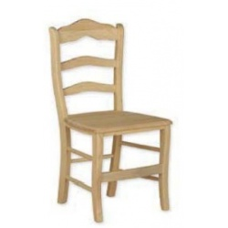
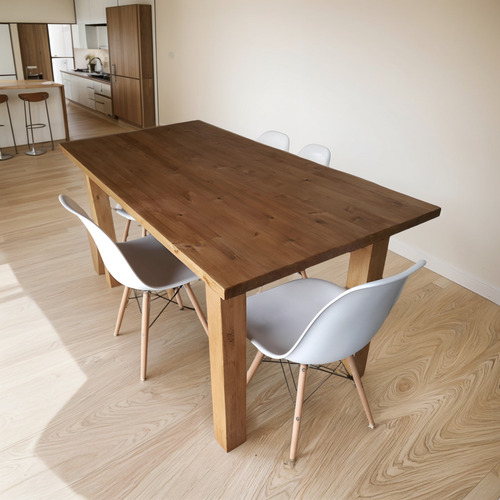
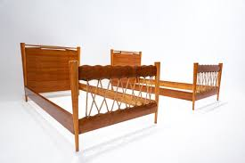
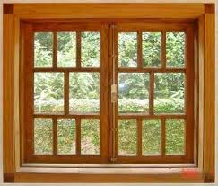
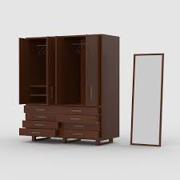
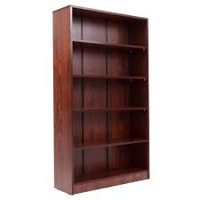
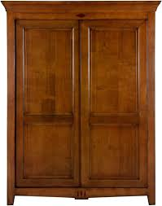
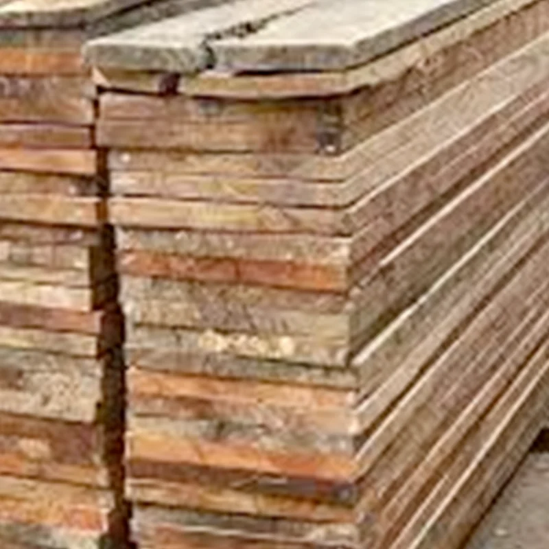
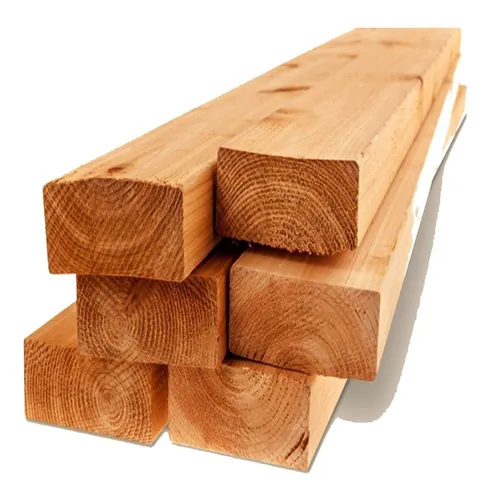

!DOCTYPE html>
<html lang="es">
<head>
  <meta charset="UTF-8">
  <title>Productos elaborados - cerezo</title>
  <link rel="stylesheet" href="style.css">
</head>
<body>
  <header class="header">
    <h1>Productos elaborados con Madera cerezo</h1>
  </header>
  <main class="productos-container"id="productos">
    

      
      <h3>Silla-cerezo</h3>
      
Precio: $150.000

      <input type="number" id="cant-silla" value="1" min="1">
      <button onclick="agregarAlCarrito('Silla cerezo, 150000, 'cant-silla')">Agregar al carrito</button>
    

    

      
      <h3>Mesa-cerezo</h3>
      
Precio: $300.000

      <input type="number" id="cant-mesa" value="1" min="1">
      <button onclick="agregarAlCarrito('mesa cerezo', 150000, 'cant-mesa')">Agregar al carrito</button>
    

    

      
      <h3>puertas-cerezo </h3>
      
Precio: $300.000

      <input type="number" id="cant-puerta" value="1" min="1">
      <button onclick="agregarAlCarrito('puerta cerezo', 150000, 'cant-puerta')">Agregar al carrito</button>
    

    

      
      <h3>cama-cerezo</h3>
      
Precio: $300.000

      <input type="number" id="cant-cama" value="1" min="1">
      <button onclick="agregarAlCarrito('cama cerezo', 150000, 'cant-cama')">Agregar al carrito</button>
    

    

      
      <h3>ventanas-cerezo</h3>
      
Precio: $300.000

      <input type="number" id="cant-ventana" value="1" min="1">
      <button onclick="agregarAlCarrito('ventana cerezo', 150000, 'cant-ventana')">Agregar al carrito</button>
    

      

        
        <h3>closed-cerezo</h3>
        
Precio: $300.000

        <input type="number" id="cant-closed" value="1" min="1">
        <button onclick="agregarAlCarrito('closed cerezo', 150000, 'cant-closed')">Agregar al carrito</button> 
      

    

      
      <h3>estanteria-cerezo</h3>
      
Precio: $300.000

      <input type="number" id="cant-estanteria" value="1" min="1">
      <button onclick="agregarAlCarrito('estanteria cerezo', 150000, 'cant-estanteria')">Agregar al carrito</button>
    

    

      
      <h3>ropero-cerezo</h3>
      
Precio: $300.000

      <input type="number" id="cant-ropero" value="1" min="1">
      <button onclick="agregarAlCarrito('ropero cerezo', 150000, 'cant-ropero')">Agregar al carrito</button>
    

    

      
      <h3>tablas-cerezo</h3>
      
Precio: $300.000

      <input type="number" id="cant-tabla" value="1" min="1">
      <button onclick="agregarAlCarrito('tablas cerezo', 150000, 'cant-tablas')">Agregar al carrito</button>
    

    

      
      <h3>listones-cerezo</h3>
      
Precio: $300.000

      <input type="number" id="cant-listone" value="1" min="1">
      <button onclick="agregarAlCarrito('listone cerezo', 150000, 'cant-listone')">Agregar al carrito</button>
    

    <a href="productos.html">← Volver a productos</a>
  

  <footer class="footer">
    
&copy; 2023 Productos de Madera Cedro. Todos los derechos reservados.

  
</body>
</html>
